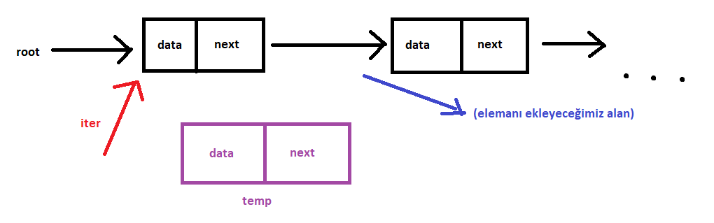
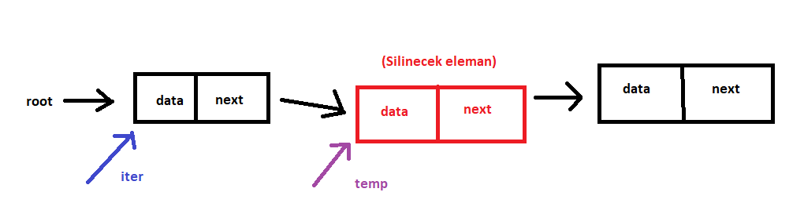
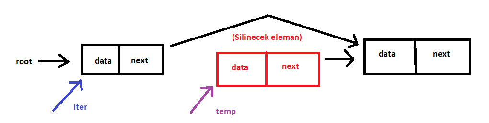

# Veri Yapıları ve Algoritmalar dersi kapsamında linked list veri yapısında veri depolayan c kodu uygulaması.
# Sıralı ekleme fonksiyonu ile verileri küçükten büyüğe sıralayarak ekleme yapar.

## Struct Yapısı:
```
struct n{
  int data;
  n * next;
};
 ```

## Kök olacak node oluşturulması:
```
node * root;
  root = NULL;
```
## Push Fonksiyonu:
push fonksiyonunda ilk olarak veri olmama olasılığını kontrol ediyoruz.
Eğer hiç veri yoksa ilk olarak malloc ile node kadar bir alan ayırıyoruz.
Ve data kısmına fonksiyona gönderilen x parametresini atıyoruz.
Ve başka veri olmadığından next'ini NULL olarak atıyoruz.
Return etmemizin sebebi main fonksiyonunda push fonksiyonunu root'a atama yaparak çağırmamızdan dolayı.
```
if(r == NULL){
  r = (node *)malloc(sizeof(node));
  r->data = x;
  r->next = NULL;
  printf("%d is pushed to node.\n", x);
  return r;
}
```

İkinci if bloğunda ise kökte tek bir eleman olduğu ve bu elemanın ekleyeceğimiz elemandan büyük olduğu durumu kontrol ediyor.
Burada bir ayrıcalık yapmamızın sebebi root'un direk olarak ilk elemanı göstermesi ve önceki elemana dönmenin bir yolu olmaması.
Bu istisnalar haricinde bir sonraki adımda göreceğiz ki araya eleman eklemek istiyorsak ekleyeceğimiz aradan bir önceki elemanda durmamız ve sonraki attribute ile elemanı sonrasına ekleyeceğiz.
```
if(r->data > x){
		node * temp = (node *)malloc(sizeof(node));
		temp->data = x;
		temp->next = r;	
		r = temp;
		printf("%d is pushed to node.\n", x);
		return r;
	}
```

Bu iki istisnadan sonra normal  durumda push işlemini gerçekleştirebiliriz.
Öncelikle bir iter oluşturuyoruz. İter göstericisi ile root'u değiştirmeden node üzerinde gezinti yapabilmeyi amaçlıyoruz.
İter'i oluşturduktan sonra root'un işaret ettiği yeri iter'e atıyoruz.
Ve while döngüsüyle sonraki değer NULL olmadığı sürece (node'un sonu) ve sonraki değerin datası ekleyeceğimiz değerden büyük olana kadar
iter'i bir sonraki elemana işaret ettiriyoruz.
Böylece iter ekleyeceğimiz alandan bir önceki elemanı işaret ediyor şuanda.
```
while(iter->next != NULL && iter->next->data < x){
		iter = iter->next;
	}
```

Sonrasında temp adında geçici bir işaretçi oluşturarak bunun için malloc ile bir alan ayırıyoruz.
temp işaretçisini araya koymak için temp'in nextini iter'in next'ine atıyoruz.
Ve iter'in next'ini de temp'e atadığımız zaman temp artık iki elemanın arasına yerleşmiş oluyor.
Ve tabiki son olarak temp'in data'sına fonksiyona gönderilen x parametresini atıyoruz.

```
temp->next = iter->next;
iter->next = temp;
temp->data = x;
```

## Pop fonksiyonu:
İlk olarak bir işaretçi iter oluşturup bunu root'un işaret ettiği yeri atıyoruz.
İter işaretçisi şuan node'un başında ve eleman eleman ilerleyerek aradığımız x değerini bulmalıyız.
İlk if ile node'un boş olup olmadığını kontrol ediyoruz. 
```
if(iter == NULL){
		printf("This node is empty.\n");
		return r;
}
```

İkinci if ile tek bir eleman varsa kontrolü yapıyoruz.
Ve eğer tek bir eleman varsa bu elemanı silince root direk olarak NULL değerini göstermeli.
Ve tabii ki ayırdığımız elemanı ram üzerinden de silmek için geçici bir değişkene atıyoruz.
Ve root'u NULL'a işaret ettikten sonra temp'in işaret ettiği elemanı da free fonksiyonu ile ramden siliyoruz.
```
if(iter->next == NULL){
		node *temp = r;
		r = NULL;
		free(temp);
		printf("%d is deleted.\n", x);
		return r;
}
```

Bu kontrolleri yaptıktan sonra node üzerinde iter'i gezdirerek aradığımız elemanı bulup silebiliriz.
Bunun için bir while döngüsü açıyoruz ve NULL değerine kadar iter'i sonraki elemana atıyoruz.
İlk if ile ilk eleman aradığımız değer ise kontrolü yapıyoruz.
Ve ilk eleman aradığımız yani sileceğimiz değer ise bu değeri bir temp işaretçisine atarak root'un bir sonraki elemanı işaret etmesini sağlıyoruz.
Ve sonrasında free fonksiyonu ile temp'in işaret ettiği elemanı siliyoruz.
```
if(r->data == x){
			node * temp = r;
			r = r->next;
			free(temp);
			printf("%d is deleted.\n", x);
			return r;
}
```

Sonraki if ile iter'in işaret ettiği elemanın sonraki elemanının data'sı aradığımız değer ise kontrolü yapıyoruz.
Sonraki elemanı kontrol etmemizin sebebi node üzerinde geri gidemememiz ve aşağıdaki resimde görüldüğü üzere silme işlemi için önceki elemana erişmemiz gerekmekte.
```
if(iter->next->data == x){
			node* temp = iter->next;
			iter->next = iter->next->next;
			free(temp);
			printf("%d is deleted.\n", x);
			return r;
} 
```



## Show fonksiyonu:
Show fonksiyonunda node'un boş olup olmadığını kontrol ediyoruz.
Sonra node üzerinde gezecek bir iter tanımlayarak NULL değerini bulana kadar sonraki değerleri atayarak ekrana yazdırıyoruz.
```
void show(node * r){
	if(r == NULL){
		printf("This node is empty.\n");
		return;
	}
	node * iter = r;
	while(iter != NULL){
		printf("%d\n",iter->data);
		iter = iter->next;
	}
}
```


